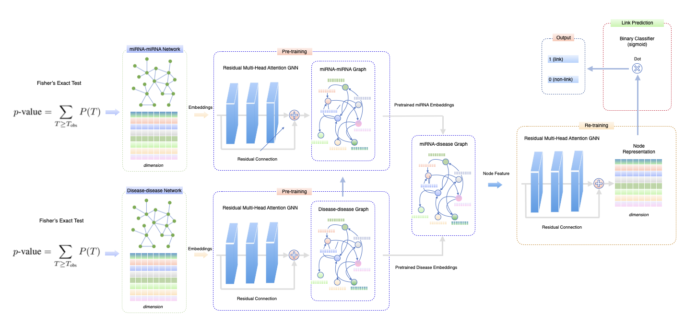

# PERGAT: Pretrained Embeddings of Graph Neural Networks for miRNA-Cancer Association Predictions

This repository contains the code for our paper,  
**"PERGAT: Pretrained Embeddings of Graph Neural Networks for miRNA-Cancer Association Prediction,"**  
published at the **IEEE International Conference on Bioinformatics & Biomedicine (BIBM) 2024**,  
held from **December 3-6, 2024, in Lisbon, Portugal**.




## Data resources
The different dataset and KG used in this project are located in data directory. These files include:

-) dbDEMC: A Database of Differentially Expressed miRNAs in Human Cancers (https://www.biosino.org/dbDEMC/index)

-) HMDD: the Human microRNA Disease Database (http://www.cuilab.cn/hmdd)

-) miR2Disease: (http://www.mir2disease.org/)

## Setup

-) conda create -n gnn python=3.11 -y

-) conda activate gnn 

-) conda install pytorch::pytorch torchvision torchaudio -c pytorch

-) pip install pandas

-) pip install py2neo pandas matplotlib scikit-learn

-) pip install tqdm

-) conda install -c dglteam dgl

-) pip install seaborn

##
pip install -r requirements.txt

-) conda activate gnn 

-) conda install pytorch::pytorch torchvision torchaudio -c pytorch

-) pip install pandas

-) pip install py2neo pandas matplotlib scikit-learn

-) pip install tqdm

-) conda install -c dglteam dgl

-) pip install seaborn

## Get start
## get embedding
python PERGAT_embedding/gat_embedding.py --in_feats 256 --out_feats 256 --num_layers 2 --num_heads 2 --batch_size 1 --lr 0.0001 --num_epochs 105

PERGAT_embbedding % python gat_embedding.py --in_feats 256 --out_feats 256 --num_layers 2 --num_heads 2 --batch_size 1 --lr 0.0001 --num_epochs 107

## prediction
python main.py --in-feats 256 --out-feats 256 --num-heads 8 --num-layers 2 --lr 0.001 --input-size 2 --hidden-size 16 --feat-drop 0.5 --attn-drop 0.5 --epochs 1000    

## Citation

If you find this project useful for your research, please cite it using the following BibTeX entry:

```bibtex
@inproceedings{DBLP:conf/bibm/LiSM24,
  author       = {Sa Li and
                  Jonah Shader and
                  Tianle Ma},
  editor       = {Mario Cannataro and
                  Huiru Jane Zheng and
                  Lin Gao and
                  Jianlin Cheng and
                  Jo{\~{a}}o Lu{\'{\i}}s de Miranda and
                  Ester Zumpano and
                  Xiaohua Hu and
                  Young{-}Rae Cho and
                  Taesung Park},
  title        = {{PERGAT:} Pretrained Embeddings of Graph Neural Networks for miRNA-Cancer
                  Association Prediction},
  booktitle    = {{IEEE} International Conference on Bioinformatics and Biomedicine,
                  {BIBM} 2024, Lisbon, Portugal, December 3-6, 2024},
  pages        = {5776--5785},
  publisher    = {{IEEE}},
  year         = {2024},
  url          = {https://doi.org/10.1109/BIBM62325.2024.10822135},
  doi          = {10.1109/BIBM62325.2024.10822135},
  timestamp    = {Tue, 04 Feb 2025 10:04:57 +0100},
  biburl       = {https://dblp.org/rec/conf/bibm/LiSM24.bib},
  bibsource    = {dblp computer science bibliography, https://dblp.org}
}
