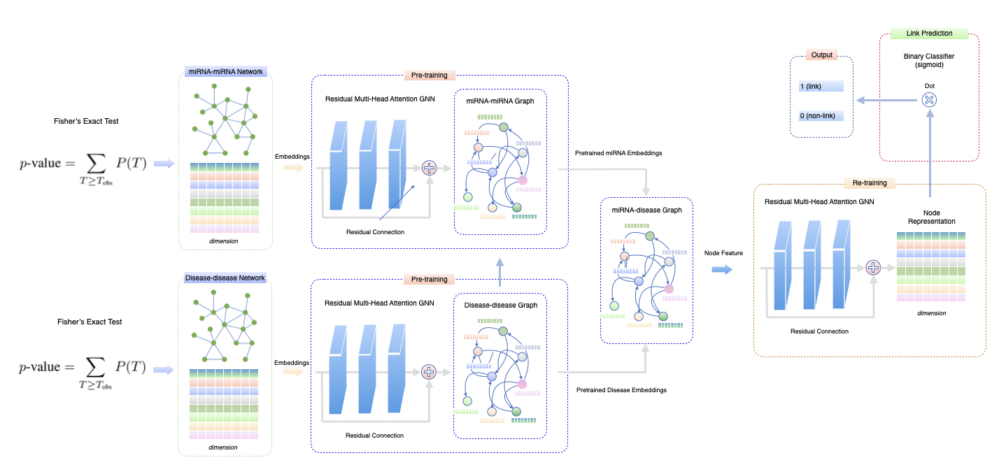

# PERGAT: Pretrained Embeddings of Graph Neural Networks for miRNA-Cancer Association Prediction

This repository contains code for the paper **[“PERGAT: Pretrained Embeddings of Graph Neural Networks for miRNA-Cancer Association Prediction”](https://ieeexplore.ieee.org/document/10822135)**, published in the Proceedings of the IEEE International Conference on Bioinformatics & Biomedicine (BIBM 2024). The conference took place in Lisbon, Portugal, on December 3–6, 2024.



## Repository contents

The repository contains separate workflows for generating node embeddings and predicting miRNA-disease links:

- `gcn_embedding/` contains the GCN embedding-generation code.
- `mirna_disease_prediction/` contains a GAT link-prediction script and its graph data.

Run the commands below from the `PERGAT/` directory unless a step says otherwise.

## Data resources

The project uses data from these miRNA and cancer resources:

- [dbDEMC](https://www.biosino.org/dbDEMC/index): Database of Differentially Expressed miRNAs in Human Cancers.
- [HMDD](http://www.cuilab.cn/hmdd): Human microRNA Disease Database.
- [miR2Disease](http://www.mir2disease.org/): miRNA-disease association database.

Prepared graph data and experiment-specific input files are stored in the corresponding workflow directories. A downloadable prepared graph is also linked in the prediction section below.

## Installation

Create and activate the Conda environment, then install PyTorch and DGL:

```bash
conda create --name gnn python=3.11.3
conda activate gnn
conda install pytorch torchvision torchaudio -c pytorch
conda install -c dglteam dgl
```

## Generate embeddings

The embedding-generation script reads the dbDEMC train and test CSV files from `gcn_embedding/data/`. From the repository root, run:

```bash
cd gcn_embedding && python gcn_embedding.py \
  --in_feats 256 \
  --out_feats 256 \
  --num_layers 2 \
  --num_heads 2 \
  --batch_size 1 \
  --lr 0.0001 \
  --num_epochs 105
```

By default, the script saves the generated embeddings to `gcn_embedding/data/emb/embeddings.pkl`.

## Predict miRNA-disease associations

Download the prepared graph data and place `miRNA_disease_network.json` in `mirna_disease_prediction/data/`:

- [Download the prepared graph data](https://drive.google.com/drive/folders/18K7bDAtG2ctXZlMBBiApl8slcJ7_s3ci?usp=drive_link)

Run the GAT prediction script from the `PERGAT/` directory:

```bash
python mirna_disease_prediction/main.py \
  --in-feats 256 \
  --out-feats 256 \
  --num-heads 8 \
  --num-layers 2 \
  --lr 0.001 \
  --input-size 2 \
  --hidden-size 16 \
  --feat-drop 0.5 \
  --attn-drop 0.5 \
  --epochs 1000
```

## Citation

If you use this project, please cite the paper:

```bibtex
@inproceedings{DBLP:conf/bibm/LiSM24,
  author    = {Sa Li and Jonah Shader and Tianle Ma},
  title     = {{PERGAT:} Pretrained Embeddings of Graph Neural Networks for miRNA-Cancer Association Prediction},
  booktitle = {Proceedings of the IEEE International Conference on Bioinformatics and Biomedicine (BIBM)},
  pages     = {5776--5785},
  year      = {2024},
  address   = {Lisbon, Portugal},
  publisher = {IEEE},
  doi       = {10.1109/BIBM62325.2024.10822135},
  url       = {https://ieeexplore.ieee.org/document/10822135}
}
```
